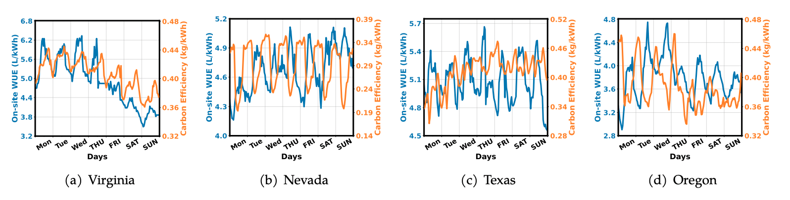
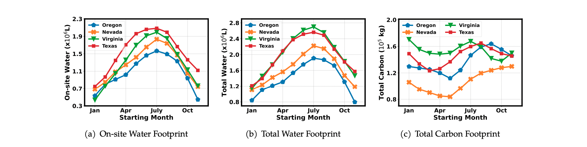

# Making AI Less ''Thirsty'': Uncovering and Addressing the Secret Water Footprint of AI [[PDF](http://arxiv.org/abs/2304.03271)]

[](LICENSE.md)

[Pengfei Li](https://www.cs.ucr.edu/~pli081/), [Jianyi Yang](https://jyang-ai.github.io/), [Mohammad A. Islam](https://crystal.uta.edu/~mislam/) and [Shaolei Ren](https://intra.ece.ucr.edu/~sren/)*

(*corresponding author)

**Note**

This is the official implementation of the arxiv paper [[PDF](http://arxiv.org/abs/2304.03271)]

## Requirements

* python>=3.6

## Installation
* Clone this repo:
```bash
git clone https://github.com/Ren-Research/Making-AI-Less-Thirsty.git
cd Making-AI-Less-Thirsty
```
* Install dependencies:
```bash
pip install -r requirements.txt
```

## Results

- Hourly carbon efficiency and on-site WUE for the first week of August 2022.



- Estimated water and carbon footprints of training LaMDA with different starting months in 2022.



## Citation
```
@article{ren2023water,
  title={Making AI Less "Thirsty": Uncovering and Addressing the Secret Water Footprint of AI Models},
  author={Li, Pengfei and Yang, Jianyi and Islam, Mohammad A. and Ren, Shaolei},
  journal={arXiv preprint arXiv:2304.03271},
  year={2023}
}
```

## Acknowledgement
* Energy data from [EIA Opendata Project](https://www.eia.gov/opendata/).
* Weather data from [Iowa Environmental Mesonet](https://mesonet.agron.iastate.edu/).
